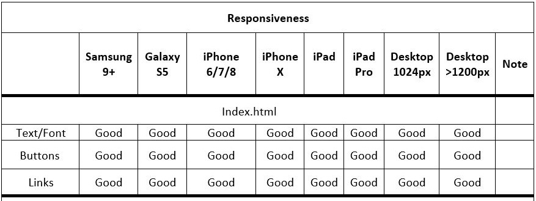
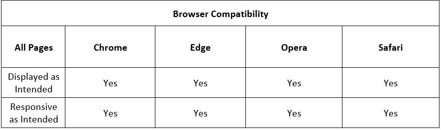

# 1.0 Project Name: Standard Web Calculator 
The aim of the project is to design a Online Simple Calculator that can be used to do simple arithmetic operations of addition, subtraction, multiplication and division. The Calculator consists of a user-friendly interface with easy-to-use buttons and a display unit where the numbers typed and the result of arithmetic operations can be seen by the user.

Click this link to view the website https://adey-px.github.io/milestone2/

## 2.0 UX
The online Calculator is desinged for people who need to do day-to-day simple arithmetic operations and probably they need an alternative Calculator App when their mobile phone or computer's calculator app is not working properly due to computer virus or any other issue. It is also designed for people who just prefer to do every of their stuff online, they have prefernce for online activities rather than offline things.

### 2.1 User stories
As a user I want to:
1. add various numbers and get accutrate results 
2. subtract numbers and get accurate results
3. Multiply two or more numbers and get correct values
4. do division of numbers and obtain right answers
5. input whole numbers and decimal numbers to add, subtract, divide or Multiply
6. delete last number or set of numbers while typing to ensure correct input
7. clear the Calculator screen 
6. get result of performing simple arithmetic operations
9. view result as output on the display unit

### 2.2 Wireframes
In order to bring the idea of this project to life, wireframes were produced with the use of <a href="https://www.figma.com/file/IF5iAbl1WWC48VdG7HyFSA/Web-Calculator?node-id=0%3A1">Figma</a>
The folder named "wireframe" has been uploaded in this project's GitHub repository. The folder contains images of the wireframes designed to show Desktop, Tablet and Mobile views of the site.

## 3.0 Features
## 3.1 Existing Features
1. The Online calculator consists of number keys from 0-9 which allow users to type in numbers to add, subtract, divide or multiply
2. It consists of simple arithmetic operation keys for addition, subtraction, division and multiplication
3. It has utility keys including keys for backspace and clearing screen
4. It consists of decimal key to allow arithmetic operations on decimal numbers
5. It consists of equal key that allow user to obtain accurate result after performing any simple arithmetic operation 
6. It consists of a display unit that works like a screen which allows user to view the output or result after performing any simple arithmetic operation
7. The site has a link to enable user send feedback by email on their experience using the online calculator

## 3.2 Features Left to Implement
1. To add advanced keys which can allow user to perform scientific calculations such as tangent and cosine
2. To make the calculator be able to clear screen automatically without pressing Clear (AC) button when a user wants to start a new arithmetic operation after getting result of previuos opertaion

## 3.3 Languages and Technologies Used
1. <a href="https://en.wikipedia.org/wiki/HTML">HTML5:</a>
   The project uses HTML5 for site content
2. <a href="https://en.wikipedia.org/wiki/CSS">CSS3:</a>
   The project uses CSS3 for styling
3. <a href="https://en.wikipedia.org/wiki/JavaScript">JavaScript:</a>
    It uses JavaScript for interactivity
4. <a href="https://fontawesome.com/">Font Awesome:</a> 
   It uses Font Awesome for Star Rating

## 4.0  Testing
The number keys, arithmetic operation keys and all other keys on the calculator work well and the website looks good on Chrome, Mozilla and Edge browsers. The online calculator is responsive on tablets and mobile devices.

### 4.1 Code Validation
1. HTML codes were tested with <a href="https://validator.w3.org/#validate_by_input" target="_blank">W3C MarkUp Validation Service</a>. The codes returned with no error.

2. CSS codes were tested with <a href="https://jigsaw.w3.org/css-validator/" target="_blank">W3C CSS Validation Service</a>. The codes returned with no error.

3. JavaScript codes were tested with <a href="https://jshint.com/" target="_blank">JSHint</a>. The codes returned with no error.

### 4.2 Testing Responsiveness 

### 4.3 Testing Browser Compatibility
 

### 4.4 Testing User Story 
As a user I want to: 
1. add various numbers and get accutrate results.  
When a user types numbers to be added and presses the addition key, he is able to obtain correct answer in the display unit

2. subtract numbers and get accurate results.  
When a user types numbers to be subtracted and presses the subtraction key, he is able to obtain correct answer in the display unit

3. multiply two or more numbers and get correct values.  
When a user types numbers to be multiplied and presses the multiplication key, he is able to obtain correct answer in the display unit

4. do division of numbers and obtain right answers.  
When a user types numbers to be divided and presses the division key, he is able to obtain correct answer in the display unit

5. input whole integers and decimal numbers to add, subtract, divide or Multiply.  
When a user presses the number keys, he is able to input both whole numbers and decimals

6. delete last number or set of numbers while typing to correct any error in input.  
When a user presses the Backspace button, he is able to delete the numbers typed one at a time from the last number

7. clear the Calculator screen.  
When a user presses the AC button, which works as clear screen, he is able to clear the calculator screen 

8. get result of performing simple arithmetic operations.  
When a user presses the Equal button, he is able to get result of the specific arithmetic operation he does

9. view result as output on the display unit.  
A user is able to view result in the display unit after doing a simple arithmetic operation

### 4.5 Bugs
1. The claculator keys not working as expected. I fixed this bug by contacting Tutor support and watching more videos on YouTube to get more ideas
2. The calculator not responsive on mobile devices. I fixed this bug by adding some media queries in the css file

## 5.0 Deployment
### 5.1 This project is hosted on GitHub as GitHub pages using this procedure:
1.	Login into my GitHub account
2.	On the navigation menu, click on Settings Tab on the right side
3.	Scroll down to GitHub Pages Section
4.	Click on the drop-down menu under Source and select Master Branch

### 5.2 The project is cloned on using these steps:
1. On GitHub, navigate to the main page of the repository
2. Above the list of files, click  Code
3. Under "Clone with HTTPS" tab, click to copy the link
4. In the workspace terminal, type git clone and paste the copied link

## 6.0 Credits
### 6.1 Learning Resources
I learnt the JavaScript programming of Calculator by watching various videos on YouTube including the following:
1. https://www.youtube.com/watch?v=CI2GwL--ll8
2. https://www.youtube.com/watch?v=6v4vBXL-qkY&t=652s
3. https://www.youtube.com/watch?v=JDiurjhpOXA

### 6.3 Acknowledgement
I got the inspiration for this project from the Calculator App on my Android phone

